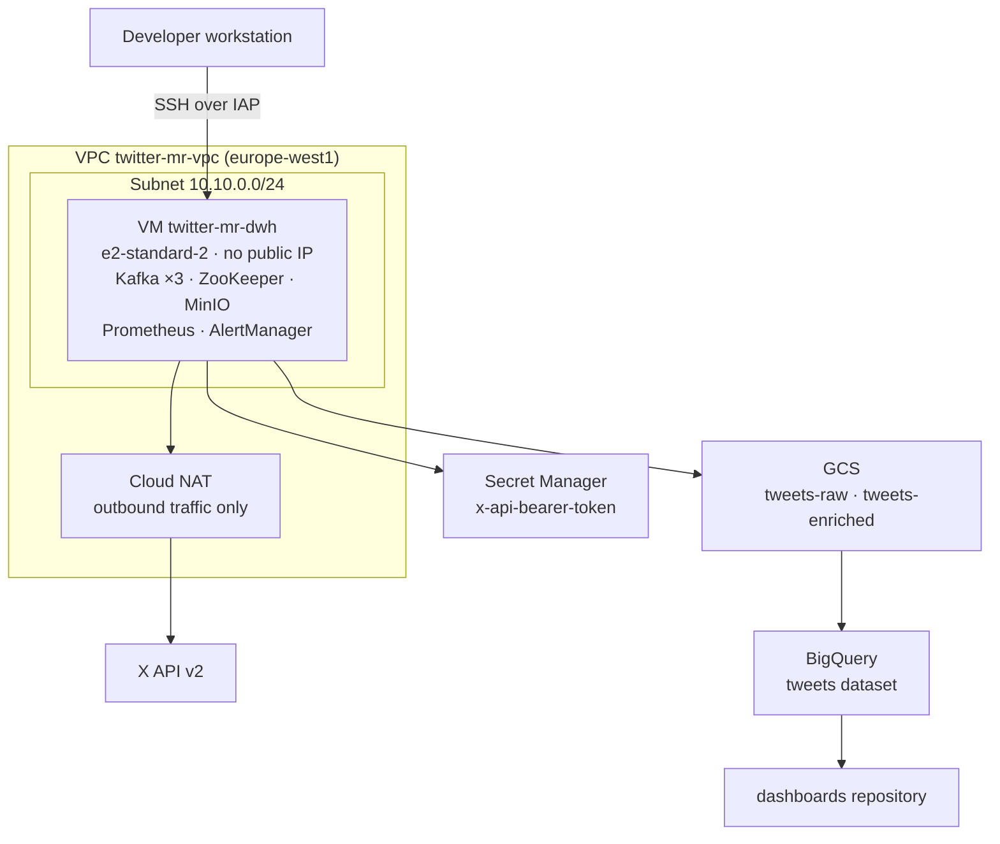

# twitter-market-research-iac

Infrastructure-as-Code for the **Twitter Market Research** platform: provisioning,
configuration and deployment of the Ligue 1 data platform on Google Cloud.

## Role in the architecture

The project is split across three repositories with distinct lifecycles:

| Repository | Responsibility |
|---|---|
| [`twitter-market-research-dwh`](https://github.com/twitter-market-research/twitter-market-research-dwh) | Data platform: ingestion, storage, processing, monitoring |
| **`twitter-market-research-iac`** *(this repository)* | Infrastructure: network, VM, identities, secrets, storage |
| `twitter-market-research-dashboards` | Business dashboards |

**Boundary with the `dwh` repository**: this repository provides the *machine* and the
*runtime environment*. The `docker-compose.yml` describing the containers belongs to the
`dwh` repository and is never copied here — Ansible pulls it from its source.

## Provisioned architecture



## Requirements

- A **Linux** environment (WSL2 works) — Ansible is not supported as a control node
  on Windows.
- `gcloud` CLI, `terraform` (~> 1.9), `ansible`
- A GCP project with billing enabled
- An X API v2 Bearer token (Basic tier)

## Getting started

### 1. Authentication

```bash
gcloud auth login                        # for the gcloud CLI
gcloud auth application-default login    # for Terraform (ADC)
```

Both are required: the first authenticates `gcloud`, the second creates the
*Application Default Credentials* that client libraries — including Terraform —
look for.

### 2. Backend bootstrap

The bucket hosting the Terraform state must exist **before** Terraform runs. It is the
only resource in the whole project created outside of IaC.

```bash
cp .env.dist .env      # then fill in PROJECT_ID
set -a; source .env; set +a
./bash/create_bucket.sh
```

The script is idempotent and safe to re-run.

### 3. Provisioning

```bash
cd terraform
terraform init
terraform plan -out=tfplan     # READ the plan in full
terraform apply tfplan
```

### 4. Storing the secret

Terraform creates the secret *container*, never its *value* — anything Terraform manages
ends up in plain text in the state file.

```bash
printf '%s' "$X_BEARER_TOKEN" | \
  gcloud secrets versions add x-api-bearer-token --data-file=-
```

Use `printf '%s'` rather than `echo`: the latter appends a newline that would become
part of the secret.

## Repository layout

```
bash/
  create_bucket.sh      State bucket bootstrap (outside Terraform)
terraform/
  backend.tf            GCS backend (remote state, locked, versioned)
  providers.tf          Terraform and google provider version constraints
  variables.tf          Input variables
  terraform.tfvars      Production environment values (no secrets)
  network.tf            VPC, subnet, Cloud NAT, IAP firewall rule
  services.tf           GCP API enablement            [planned]
  storage.tf            GCS buckets and BigQuery dataset  [planned]
  iam.tf                VM service account            [planned]
  secrets.tf            Secret Manager container      [planned]
  compute.tf            DWH virtual machine           [planned]
  outputs.tf            Contract exposed to other repositories  [planned]
ansible/                VM configuration              [planned]
```

## Architecture decisions

| Decision | Rationale |
|---|---|
| **Dedicated VPC, `default` VPC deleted** | The default VPC opens ports 22 and 3389 to `0.0.0.0/0` across 44 regions. A VM created by mistake would be publicly exposed. |
| **No public IP on the VM** | A public IP is continuously scanned. Outbound traffic goes through Cloud NAT: egress allowed, ingress impossible. |
| **SSH over IAP only** | Access depends on an IAM role and is revoked without touching the firewall. No port is open to the internet. |
| **Dedicated service account** | The default Compute service account carries the `Editor` role on the entire project. A flaw in any container would compromise everything. |
| **Permissions bound to resources** | Roles are attached to each bucket / secret / dataset rather than to the project, so the VM cannot reach the state bucket. |
| **Secret kept out of the state** | The Terraform state stores everything it manages in plain text. |
| **`europe-west1` everywhere** | GDPR consistency, and BigQuery can only load from a colocated bucket. |
| **Versioning on the state bucket** | The state is the only map linking the code to the real infrastructure. Losing it means losing control of the platform. |
| **BigQuery as the serving layer** | The four project KPIs are plain SQL aggregations (`GROUP BY` / `COUNT` / `AVG`). At ~10k tweets/month the volume sits several orders of magnitude below BigQuery's free tier, and it consumes no RAM on the VM. MinIO remains the raw layer, MongoDB the application store. |

## Accessing the VM

```bash
gcloud compute ssh twitter-mr-dwh --zone=europe-west1-b --tunnel-through-iap
```

Required IAM roles: `roles/compute.osLogin` and `roles/iap.tunnelResourceAccessor`.

Service web interfaces are not exposed; reach them through a tunnel:

```bash
# Kafka UI at http://localhost:8080
gcloud compute start-iap-tunnel twitter-mr-dwh 8080 \
  --local-host-port=localhost:8080 --zone=europe-west1-b
```

## Contract exposed to other repositories

`terraform output` publishes the values consumed downstream:

| Output | Consumer |
|---|---|
| `vm_name`, `vm_internal_ip` | Ansible inventory |
| `dwh_service_account` | `dwh` application configuration |
| `bucket_tweets_raw`, `bucket_tweets_enriched` | `dwh` pipelines |
| `bigquery_dataset` | `dashboards` repository |

## Estimated costs

| Resource | Order of magnitude |
|---|---|
| `e2-standard-2` VM (2 vCPU, 8 GB), running continuously | ~€50/month |
| 50 GB `pd-balanced` disk | ~€5/month |
| Cloud NAT | ~€3/month |
| GCS + BigQuery (very low volumes) | negligible |

A **stopped VM is not billed** (only its disk is). A budget alert should be configured
on the billing account before leaving the VM running unattended.

## Conventions

- Every resource goes through Terraform. A resource absent from the state does not exist.
- Run `terraform fmt` before every commit.
- Commits follow [Conventional Commits](https://www.conventionalcommits.org/).
- No secrets in the repository: no `.env`, no `.tfvars` values, no service account key file.
