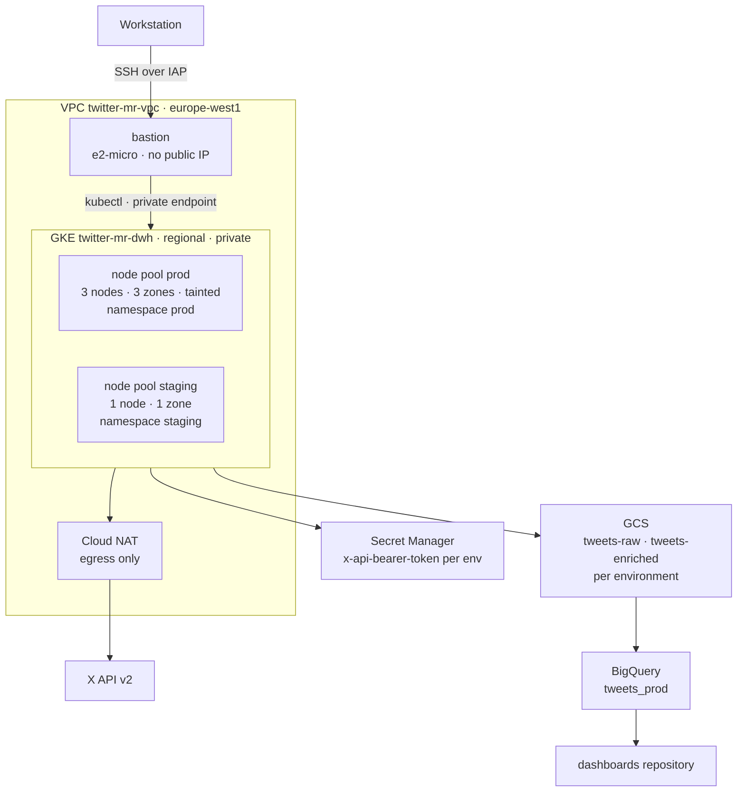

# TWITTER MARKET RESEARCH — IAC


**Twitter Market Research** measures how the football audience talks about video
analysis, match statistics and AI — the market a video-analysis product would enter.
The hard part is not collecting tweets but *paying* for them: the X API quota is
metered and finite, so every collected post is a purchase that must never be lost,
never be duplicated and never be spent on noise.

This repository owns the **infrastructure** that constraint implies: a private,
regional GKE cluster, an immutable raw storage layer, a warehouse for the KPIs, and
identities designed so that no human ever holds the API token.

> Data platform: [twitter-market-research-dwh](https://github.com/twitter-market-research/twitter-market-research-dwh) ·
> Dashboards: `twitter-market-research-dashboards`.
> **Compose runs the stack on a laptop; Kubernetes runs it in production.**

## Table of contents

- [Overview](#overview)
- [Provisioned architecture](#architecture)
- [Tech stack](#tech-stack)
- [Terraform layout](#terraform-layout)
- [Environments and isolation](#environments)
- [Getting started](#getting-started)
- [Accessing the cluster](#access)
- [Human roles](#roles)
- [Repository structure](#structure)
- [Architecture decisions](#decisions)
- [Operating window and costs](#operations)
- [Status](#status)
- [Conventions](#conventions)

---

<a id="overview"></a>

## Overview

The project is split across three repositories with distinct lifecycles, so that a
dashboard colour change never redeploys a Kafka broker:

| Repository | Responsibility |
|---|---|
| [`twitter-market-research-dwh`](https://github.com/twitter-market-research/twitter-market-research-dwh) | Data platform: ingestion, processing, monitoring |
| **`twitter-market-research-iac`** *(this repository)* | Infrastructure: network, GKE, identities, secrets, storage |
| `twitter-market-research-dashboards` | Business dashboards |

The same container images run in both worlds. Locally they are wired by the
`docker-compose.yml` of the `dwh` repository; in production they are wired by
Kubernetes manifests and the Strimzi operator.

> **Known debt** — the stack is therefore described twice. Any change to images,
> ports or configuration must land in both descriptions, or they drift and bugs stop
> reproducing locally.

<a id="architecture"></a>

## Provisioned architecture



No node, no control plane and no bucket is reachable from the internet. Outbound
traffic leaves through Cloud NAT; inbound access exists only through the IAP tunnel.

<a id="tech-stack"></a>

## Tech stack

| Layer | Technology | Defined in |
|---|---|---|
| Landing zone | Terraform 1.9 · Google provider 6.x | [terraform/envs/](terraform/envs/) |
| Network | Custom VPC, Cloud NAT, IAP-only firewall | [modules/network/](terraform/modules/network/) |
| Container platform | GKE regional, private nodes and endpoint, Dataplane V2 | [modules/gke/](terraform/modules/gke/) |
| Event streaming | Apache Kafka operated by Strimzi | *[planned]* |
| Raw and enriched storage | Cloud Storage, versioned, per environment | [modules/storage/](terraform/modules/storage/) |
| Warehouse | BigQuery, production only | [modules/warehouse/](terraform/modules/warehouse/) |
| Secrets | Secret Manager, read through Workload Identity | [modules/secrets/](terraform/modules/secrets/) |
| Identities | Dedicated node and workload service accounts | [modules/iam-roles/](terraform/modules/iam-roles/) |
| Host configuration | Ansible — bastion only | [ansible/](ansible/) |

<a id="terraform-layout"></a>

## Terraform layout

Three root modules, three independent states, three lifecycles:

| Root | Backend prefix | Contains | Changes |
|---|---|---|---|
| `envs/platform` | `platform` | APIs, VPC, subnet, NAT, firewall, GKE cluster, node service account | Rarely. Breaks everyone when it does. |
| `envs/prod` | `prod` | Production buckets, BigQuery dataset, secret | Often. Affects production only. |
| `envs/staging` | `staging` | Staging buckets, secret | Often. Affects nothing else. |

`prod` and `staging` read `platform` through a `terraform_remote_state` data source —
read-only by construction, they cannot modify shared infrastructure.

<a id="environments"></a>

## Environments and isolation

Staging and production share **one cluster**, separated by namespaces. It is a
deliberate cost trade-off, and it means the blast radius is shared. Three mechanisms
carry the isolation:

| Mechanism | Purpose |
|---|---|
| `ResourceQuota` / `LimitRange` per namespace | Staging cannot starve the cluster |
| Node pool `taint` on prod | Staging workloads cannot land on production nodes |
| `NetworkPolicy`, default deny | Kubernetes allows all pod-to-pod traffic by default — the opposite of the VPC |

<a id="getting-started"></a>

## Getting started

### Requirements

- A **Linux** environment (WSL2 works)
- `gcloud`, `terraform` (~> 1.9), `kubectl`, `helm`, `ansible`
- A GCP project with billing enabled and a raised `SSD_TOTAL_GB` quota in `europe-west1`
- An X API v2 Bearer token (Basic tier)

### 1. Authentication

```bash
gcloud auth login                        # for the gcloud CLI
gcloud auth application-default login    # for Terraform (ADC)
```

Both are required: the first authenticates `gcloud`, the second creates the
*Application Default Credentials* that client libraries — Terraform included — read.

### 2. Backend bootstrap

The bucket holding the Terraform state must exist **before** Terraform runs. It is the
only resource in the whole project created outside of IaC.

```bash
cp .env.dist .env      # then fill in PROJECT_ID
set -a; source .env; set +a
./bash/create_bucket.sh
```

The script is idempotent and safe to re-run.

### 3. Provisioning

Order matters: `prod` and `staging` read the state of `platform`.

```bash
for e in platform prod staging; do
  (cd terraform/envs/$e && terraform init && terraform plan -out=tfplan && terraform apply tfplan)
done
```

Creating a regional cluster takes 5 to 10 minutes.

### 4. Storing the secret

Terraform creates the secret *container*, never its *value* — anything Terraform
manages ends up in plain text in the state file.

```bash
printf '%s' "$X_BEARER_TOKEN" | \
  gcloud secrets versions add x-api-bearer-token-prod --data-file=-
```

Use `printf '%s'` rather than `echo`: the latter appends a newline that would silently
become part of the secret.

<a id="access"></a>

## Accessing the cluster

The control plane has **no public endpoint**. Every `kubectl` call goes through the
bastion.

```bash
gcloud compute ssh twitter-mr-bastion --zone=europe-west1-b --tunnel-through-iap

# then, on the bastion, authenticated as yourself:
gcloud auth login
gcloud container clusters get-credentials twitter-mr-dwh --region=europe-west1
kubectl get nodes
```

**The bastion is a network hop, not an identity.** Its service account deliberately
holds no cluster permission: it provides the route, IAM provides the rights. Granting
it cluster access would collapse the whole role matrix into "whoever can SSH can do
anything".

Required IAM roles to reach it: `roles/compute.osLogin` and
`roles/iap.tunnelResourceAccessor`.

<a id="roles"></a>

## Human roles

Roles are granted to **Google Groups**, never to individuals — joining or leaving a
team must not require a `terraform apply`.

| | Data Engineer | Data Analyst | Data Scientist |
|---|---|---|---|
| BigQuery prod | `dataEditor` on `tweets_prod` | `dataViewer` on exposed **views** only | `dataViewer` |
| Sandbox dataset | — | `dataEditor` on `sandbox_analyst` | `dataEditor` on `sandbox_ds` |
| Query execution | `bigquery.jobUser` | `bigquery.jobUser` | `bigquery.jobUser` |
| GCS `tweets-raw` | `objectAdmin` | — | `objectViewer` |
| GKE prod | `container.viewer` + RBAC `view` | — | — |
| GKE staging | `container.developer` + RBAC `edit` | — | — |
| Secret Manager | — | — | — |
| Infrastructure | — | — | — |

Two rows deserve attention. **Nobody reads Secret Manager** — the token is read by the
pod through Workload Identity, and a human who sees it triggers a rotation. And
**nobody changes infrastructure**: the only identity allowed to run `terraform apply`
on production is the CI, authenticated through Workload Identity Federation. Humans do
not mutate production; pipelines do.

<a id="structure"></a>

## Repository structure

```
bash/
  create_bucket.sh          State bucket bootstrap (the only resource outside Terraform)
ansible/
  bastion.yml               Installs gcloud, kubectl and helm on the bastion
  inventory.ini             Reaches the bastion through an IAP ProxyCommand
terraform/
  modules/
    network/                VPC, subnet, secondary ranges, Cloud NAT, IAP firewall
    gke/                    Regional private cluster and its node pools
    storage/                GCS buckets, one set per environment
    warehouse/              BigQuery dataset
    secrets/                Secret Manager container
    iam-roles/              Node service account, human group bindings
    iam-workloads/          Workload Identity bindings           [planned]
    bastion/                Bastion host                         [planned]
  envs/
    platform/               Shared landing zone and cluster
    prod/                   Production data stores
    staging/                Staging data stores
```

Ansible has a single job here: preparing the bastion. GKE nodes are managed by Google,
run a hardened image and are replaced rather than configured — there is no host to
provision.

<a id="decisions"></a>

## Architecture decisions

| Decision | Rationale |
|---|---|
| **Three repositories** | Platform, infrastructure and dashboards change for different reasons and at different rhythms. |
| **Three Terraform states** | Same reasoning one level down. `platform` rarely changes and breaks everyone; environments change constantly and in isolation. |
| **Compose in dev, Kubernetes in prod** | Production needs rolling node upgrades, TLS with certificate rotation and automatic recovery. Strimzi provides all three; reproducing them on VMs is weeks of fragile work. |
| **Regional GKE cluster** | A zonal control plane is a single point of failure. Nodes spread across three zones give Kafka real redundancy. |
| **Private nodes and private control plane** | Nothing is reachable from the internet. Access goes through IAP and the bastion. |
| **Bastion carries no permission** | It provides the route; IAM provides the rights. Merging the two would void the role matrix. |
| **Separate node and workload service accounts** | The node identity only runs the cluster. Workloads borrow their own identity through Workload Identity, with no key file anywhere. |
| **Dataplane V2** | Enables native `NetworkPolicy`, without which staging pods could reach production Kafka. |
| **`max_surge = 1`, `max_unavailable = 0`** | A node upgrade adds a node before removing one, so it never breaks the ZooKeeper quorum. This is what makes `auto_upgrade` acceptable. |
| **No load balancer in front of Kafka** | Clients bootstrap against any broker, then talk directly to each partition leader. Fault tolerance lives in `bootstrap.servers`, not in a network appliance. |
| **BigQuery in production only** | The four project KPIs are plain SQL aggregations. At this volume the cost is negligible, but a staging warehouse buys nothing. |
| **Secret kept out of the state** | The Terraform state stores everything it manages in plain text. |
| **`europe-west1` everywhere** | GDPR consistency, and BigQuery can only load from a colocated bucket. |
| **Versioning on the state bucket** | The state is the only map linking the code to the real infrastructure. |
| **Quotas treated as infrastructure** | `SSD_TOTAL_GB` blocked the first cluster creation. Quotas appear in no plan and fail at the worst moment; they are checked and raised before deploying. |

<a id="operations"></a>

## Operating window and costs

The cluster runs **12:00 to 23:30 Europe/Paris, every day** — a window covering Ligue 1
kick-offs (Friday evening, Saturday and Sunday afternoons) and working sessions.
Outside it, node pools are scaled to zero: pods become `Pending`,
`PersistentVolumeClaim`s survive untouched, and everything resumes on the next start.

A weekday-only schedule would miss every match, which is where the signal is.
`node_count` carries `ignore_changes` so the scheduled resize is not reverted by the
next `terraform apply`.

| Resource | Order of magnitude |
|---|---|
| GKE regional cluster management | check current GKE pricing |
| 3 production nodes `e2-standard-2` | ~150 €/month at full time |
| 1 staging node | ~50 €/month at full time |
| Node and PVC disks (~195 GB) | ~20 €/month |
| Cloud NAT and bastion | ~10 €/month |

The daily window bills roughly 48 % of the time. A budget alert should be configured on
the billing account.

### Contract exposed to other repositories

| Output | Consumer |
|---|---|
| `cluster_name`, `cluster_location` | Deployment pipelines |
| `bucket_names` | `dwh` pipelines |
| `dataset_id` | `dashboards` repository |
| `secret_id` | Workload Identity bindings |

Dashboards consume **versioned views**, never physical tables, so the underlying schema
can change without breaking downstream consumers.

<a id="status"></a>

## Status

| Done | Planned |
|---|---|
| APIs, VPC, subnet with GKE secondary ranges, Cloud NAT, IAP firewall | Bastion and its Ansible playbook |
| Node service account with minimal roles | Human group role bindings |
| Regional private GKE cluster, prod and staging node pools | Workload Identity bindings |
| Buckets and secrets for both environments | Strimzi, Kafka topics, Kafka Connect to GCS |
| BigQuery dataset `tweets_prod` | Collector `CronJob`, Prometheus and alert routing |
| Three separated Terraform states | `NetworkPolicy`, `ResourceQuota`, scheduled scale-down, CI/CD |

<a id="conventions"></a>

## Conventions

- Every resource goes through Terraform. A resource absent from the state does not exist.
- `terraform fmt -recursive` before every commit.
- Commits follow [Conventional Commits](https://www.conventionalcommits.org/).
- No secrets in the repository: no `.env`, no `.tfvars` values, no service account key file.
- Plans are read in full before being applied; `-out=tfplan` guarantees that what was
  reviewed is what is applied.

---
